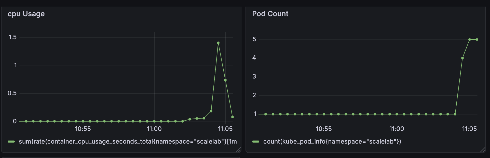

# EXP-01 결과 기록 템플릿

## Metadata

- Date: 2026-04-02
- Cluster: scalelab-eks
- Region: ap-northeast-2
- Scenario: burst
- Duration: 약 4분 30초

## Config

- Baseline (fixed): replicas=1
- HPA: min=1, max=5, targetCPU=70%
- Service image tag: v0.1.0

## Metrics Summary

- Avg latency: 1.52s
- p95 latency: 4.07s
- p99 latency: 약 4.4s
- Error rate: 0%
- Max replicas: 5
- Scale-out start: 약 11:04:30 (burst 이후 약 20~30초)
- Scale-out complete: 약 11:05:00

## Key Observations

1. burst traffic 발생 직후 CPU 사용량과 latency가 급격히 증가하며 시스템이 과부하 상태에 진입함
2. autoscaling은 즉각적으로 반응하지 않고 약 20~30초의 지연 이후 pod가 증가하기 시작함
3. scale-out 이후 pod 수가 1 → 5로 증가하면서 latency가 점진적으로 안정화됨

## Evidence

- Grafana screenshot links:
### CPU Usage (burst 구간)

### Pod Scaling (1 → 5)

- k6 summary output:
  http_req_duration: avg=1.52s, p95=4.07s, p99≈4.4s
  http_req_failed: 0%
  dropped_iterations: 5832

## result
- CPU 기반 HPA autoscaling을 적용한 결과, burst traffic 상황에서 약 20~30초의 scale-out 지연이 발생하며, 그 사이 구간에서 tail latency(p95)가 4초 이상으로 증가하는 현상을 확인했습니다,